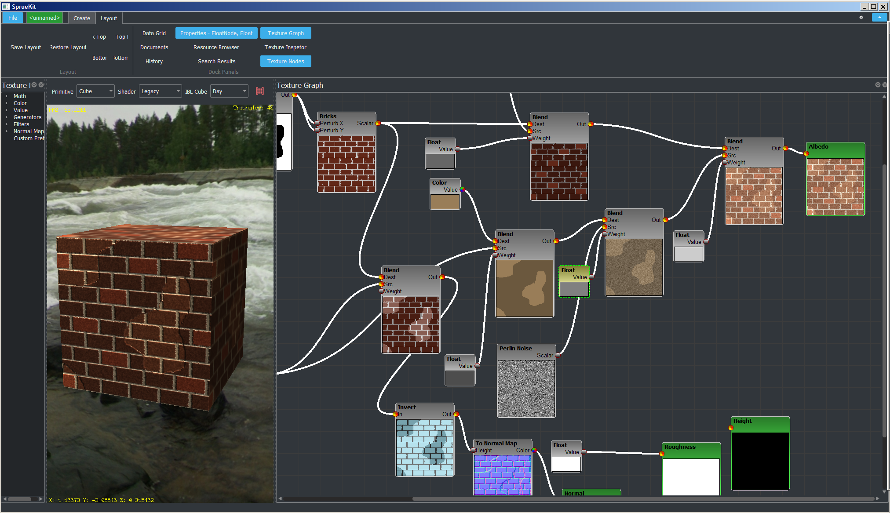
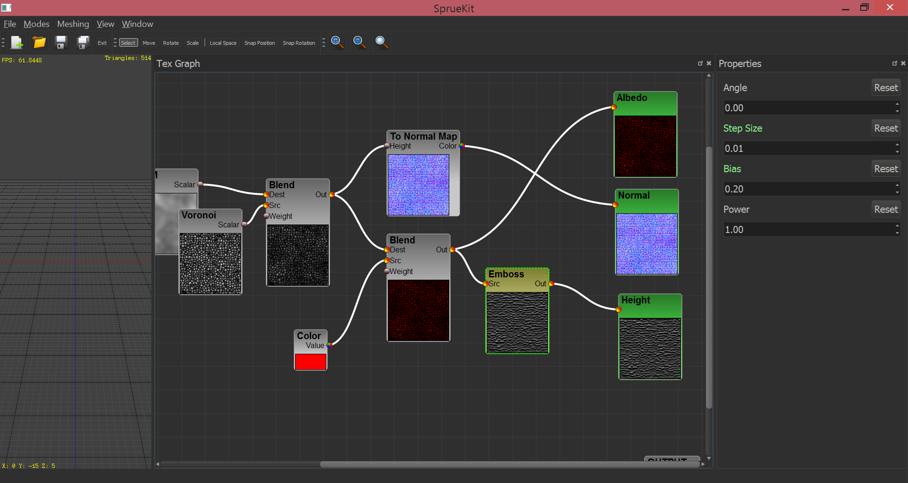

# TexGraph

MIT licensed texture-graph editor.

Not currently compilable:

Todo List:

- Premake scripts to phase out old MSVC solution build
    - will compile at that point
    - high priority
- Remove unused `IMxxxx` classes
    - QPainter ImGui implementation will remain however and be the preferred widget of use
- Drop ANL to use only FastNoise, drop 4d query for proper periodic query
- Port a couple of important nodes from the commercial incarnation:
    - LUT remapping
    - Depth/Normal render-baker (software rendering of a 3d mesh to a depth/normal map)
    - Color-cube baker, applied similarly to Valve ambient-cube lighting - does large scale mesh/normal base coloring easily

